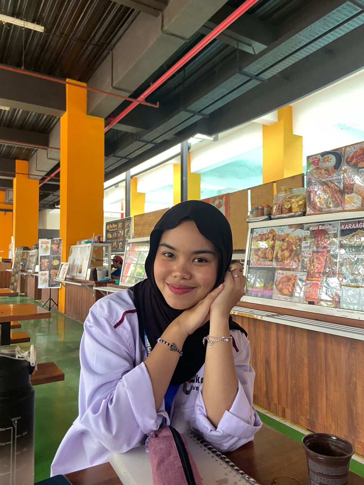
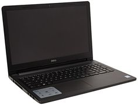

<html lang="en">
<head>
    <meta charset="UTF-8">
    <meta name="viewport" content="width=device-width, initial-scale=1.0">
    <title>Tugas Besar Jaringan Komputer</title>
    
</head>
<body class="bg-gray-100 font-sans leading-normal tracking-normal">
    <header class="bg-blue-500 text-white py-4">
        

            <h1 class="text-2xl font-bold">Tugas Besar Jaringan Komputer</h1>
        

    </header>

    <main class="container mx-auto mt-8 px-4">
        <!-- Biodata Section -->
        <section class="bg-white shadow-md rounded-lg p-6 mb-8 text-center">
            <h2 class="text-xl font-bold mb-4">Biodata</h2>
            

                
                <ul class="list-none text-gray-700">
                    <li><strong>Nama:</strong> Mardini Dwi Putri </li>
                    <li><strong>NIM:</strong> 607012430015 </li>
                    <li><strong>KELAS:</strong> D3SI 48-02 </li>
                    <li><strong>Mata Kuliah:</strong> Jaringan Komputer </li>
                    <li><strong>KODE DOSEN:</strong> TGN </li>
                </ul>
            

        </section>

        <!-- Materi Section -->
        <section class="bg-white shadow-md rounded-lg p-6 mb-8">
            <h2 class="text-xl font-bold mb-4">Perangkat Awal Jaringan Komputer: Laptop</h2>

            <h3 class="text-lg font-semibold mt-4">Pengertian</h3>
            
 Laptop didefinisikan sebagai komputer pribadi yang agak kecil, yang dapat dibawa-bawa dan dapat ditempatkan di pangkuan pengguna, 
                terdiri atas satu perangkat yang mencakupi papan tombol, layar tampilan, mikroprosesor, biasanya dilengkapi dengan baterai yang dapat diisi ulang.

            <h3 class="text-lg font-semibold mt-4">Fungsi</h3>
            
Mengetik dan membuat presentasi, Media Hiburan, Mudah dibawa atau fleksibel,
                Desain, Editing foto dan video, Alat komunikasi, Menyimpan data penting, Memudahkan pekerjaan dan aktivitas 

            <h3 class="text-lg font-semibold mt-4">Jenis Laptop</h3>
            <ul class="list-disc list-inside text-gray-700">
                <li><strong>Ultrabook:</strong> Laptop tipis dan ringan dengan performa tinggi.</li>
                <li><strong>Gaming Laptop:</strong> Laptop yang dirancang untuk kebutuhan bermain game dengan spesifikasi tinggi.</li>
                <li><strong>Notebook:</strong> Laptop dengan ukuran dan performa standar untuk penggunaan sehari-hari.</li>
                <li><strong>Workstation Laptop:</strong> Laptop untuk pekerjaan berat seperti desain grafis dan pemrograman.</li>
            </ul>

            <h3 class="text-lg font-semibold mt-4">Gambar Laptop</h3>
            
            
<a href="https://www.nesabamedia.com/">Sumber: Nesaba Media</a>

            
<a href="https://id.wikipedia.org/wiki/Laptop">Sumber: Wikipedia</a>

        </section>

        <!-- Link GDrive Section -->
        <section class="mt-8 grid grid-cols-1 md:grid-cols-2 gap-6">
            

                <h3 class="text-xl font-bold mb-4">Tutorial Hosting web</h3>
                <a href="https://drive.google.com/file/d/1yAJBmcEmanP99cNFS85dSGaWQHSzjJaT/view?usp=drive_link" class="text-blue-500 underline hover-animate">Klik di sini</a>
            

            

                <h3 class="text-xl font-bold mb-4">Isi website</h3>
                <a href="https://drive.google.com/file/d/1hpcMj6CpNydHXMCpy_8r50v7LR3aNFwp/view?usp=drive_link" class="text-blue-500 underline hover-animate">Klik di sini</a>
            

        </section>
    </main>

    <footer class="bg-blue-500 text-white py-4 mt-8">
        

            
&copy; 2024 Dini. All rights reserved.

        

    </footer>
</body>
</html>
